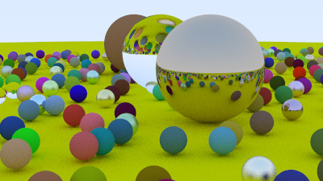

## Ray tracer in one weekend

Implementation of the ray tracer presented in the book [_Ray Tracing in One Weekend_](https://raytracing.github.io/books/RayTracingInOneWeekend.html), in Rust.

Image generated by the ray tracer:



### How to run

```
cargo run --release > image.ppm
```
